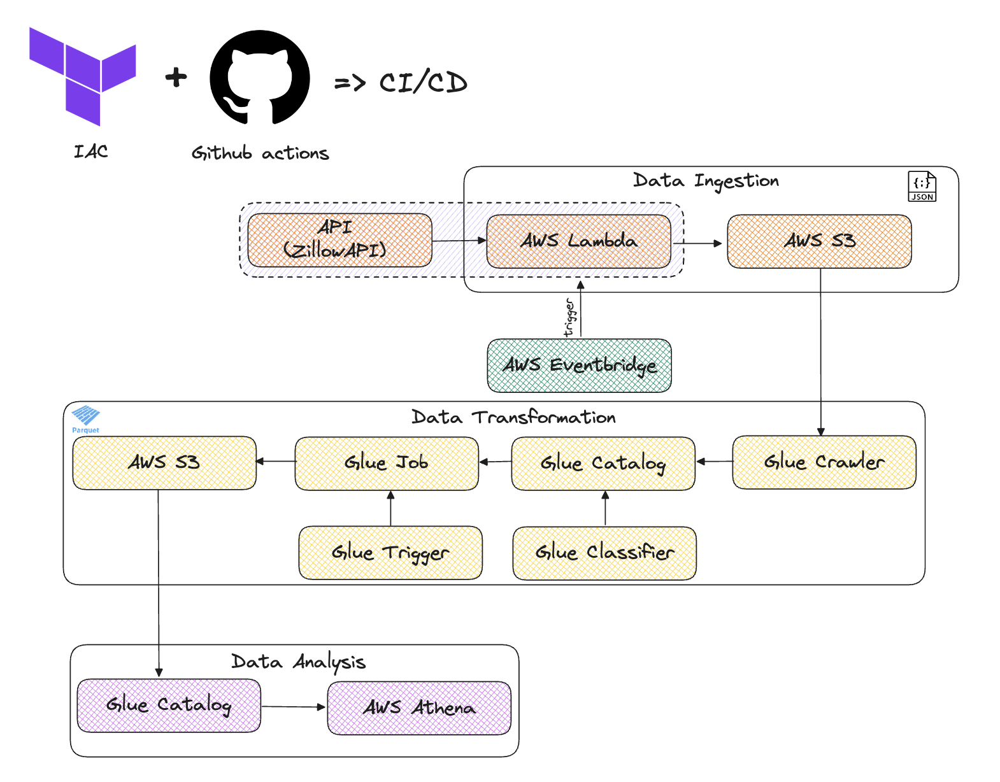

# Architecture 

# Tech Stack
- Terraform 
- Github actions (CI/CD)
- AWS Glue Data Catalog
- AWS Glue Crawler
- AWS Glue Trigger
- AWS Glue Classifier
- AWS Glue ETL Job
- AWS Lambda
- AWS Eventbridge
- Amazon S3
- Amazon Athena
- SQL
- Python

# Overwiew

In this project, I have create an ETL Job on AWS using Terraform. 
The project extract data from an API (Zillow) which are data from real estate, then, process it using AWS ETL Glue Job with Spark.
Data is extracted from the API using lambda function which is scheduled to run every day. At the end, the data is stored in an s3 bucket in a JSON format. 

The AWS Crawler then crawl the data and create a table in glue data catalog, then use AWS ETL job with Spark to process that real estate data and build a report to showcast, for each state, country the price per sqft. 

For more information you can check this meduim article : 
- [How I build an ETL pipeline with AWS Glue, Lambda and Terraform](https://medium.com/@lorenagongang/how-i-build-an-etl-pipeline-with-aws-glue-lambda-and-terraform-bbdf0788cc75)

